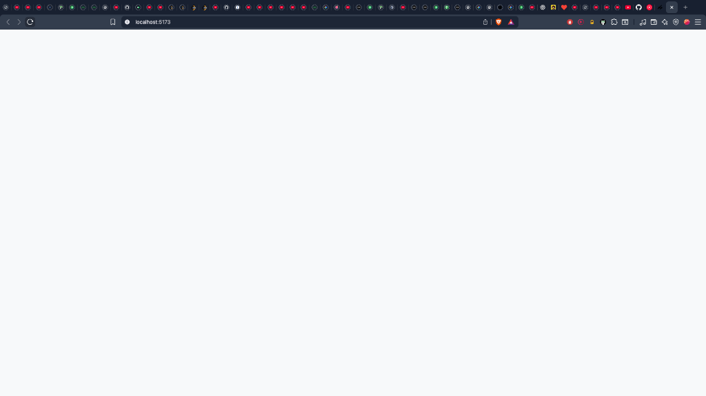

# CodeMate 🍬

**CodeMate** is a MERN-based developer matchmaking platform — think of it as **Tinder for developers**. Programmers swipe to find collaborators based on their skills, interests, and project goals.

Whether you're looking for a hackathon buddy, open-source partner, or someone who loves the same tech stack — CodeMate helps you find your **code soulmate**.



---

## 🚀 Features

- **Candyland UI**: A stunning, pastel-themed interface built with **shadcn/ui** and **Tailwind CSS**.
- **Dark Mode**: Fully supported dark mode with a dedicated toggle.
- **Swipe Logic**: Swipe right to connect, left to skip (Tinder-style).
- **Authentication**: Secure Login/Signup with Cookies & JWT.
- **Real-time Chat**: Integrated socket.io for instant messaging.
- **Feed Algorithm**: Smart feed showing relevant developers.
- **Connection Management**: View connections, accept/reject requests.

---

## 🧰 Tech Stack

| Layer | Technology |
| :--- | :--- |
| **Frontend** | React (Vite), Redux Toolkit, Tailwind CSS, **shadcn/ui** |
| **Backend** | Node.js, Express.js, Socket.io |
| **Database** | MongoDB Atlas, Mongoose |
| **Auth** | JWT (HttpOnly Cookies), bcrypt |
| **Styling** | "Candyland" Theme (HSL Variables), Lucide React Icons |

---

## 📦 Installation & Setup

### 1. Clone the Repository
```bash
git clone https://github.com/yourusername/codemate.git
cd codemate
```

### 2. Backend Setup
Navigate to the server directory and install dependencies:
```bash
cd server
npm install
```
Create a `.env` file in `server/` with:
```env
PORT=7778
MONGO_URI=your_mongodb_connection_string
JWT_SECRET=your_secret_key
```
Start the server:
```bash
npm run dev
```
>> Server runs on: `http://localhost:7778`

### 3. Frontend Setup
Navigate to the client directory and install dependencies:
```bash
cd ../client
npm install
```
Start the development server:
```bash
npm run dev
```
>> Client runs on: `http://localhost:5173`

---

## 🎨 Theme & Customization

The project uses a custom **"Candyland"** theme defined in `client/src/index.css` via CSS variables.
- **Light Mode**: Soft rose/pink gradients.
- **Dark Mode**: Deep slate/rose contrasts for a premium SaaS feel.

Toggle the theme using the sun/moon icon in the navigation bar!
